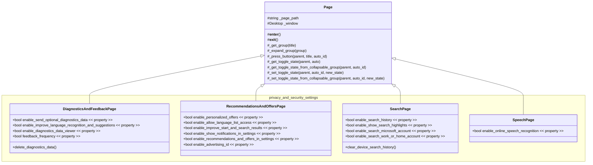

# Windows Privacy Optimizer (UIA Automation)

An automated workstation provisioning tool built with Python and `pywinauto`.

This script automates the tedious process of disabling Windows 11 telemetry, diagnostic data, and targeted advertising settings on a fresh OS installation. It directly targets the modern Universal Windows Platform (UWP) Settings app using the UIAutomation (`uia`) API.

https://github.com/user-attachments/assets/0144429e-07ad-4b5a-aad9-ba327a139582

## 🎯 Purpose

Manually toggling privacy settings after every Windows reinstall is time-consuming and prone to human error. This project serves two purposes:

1. **Utility:** Instantly hardens local Windows privacy settings.
2. **Technical Demonstration:** Showcases the ability to interact with complex, modern UWP applications, navigate dynamic UI trees, and verify element states using Python.

## ✨ Key Features

- **Direct URI Navigation:** Bypasses manual Start Menu navigation by utilizing Windows URI schemes (`ms-settings:privacy-feedback`) to launch directly into the correct contexts.
- **Idempotent Execution:** The script reads the current state of toggle switches (e.g., checking the `ToggleState` property). It only executes a click if the setting is currently enabled, preventing unintended re-enabling.
- **UIA Backend:** Utilizes `pywinauto`'s `uia` backend to successfully map and control React Native/UWP desktop elements.

## 🛠 Tech Stack

- **Language:** Python 3.13+
- **Framework:** `pywinauto` (UIAutomation backend)
- **OS Target:** Windows 11

## 🚀 Getting Started

### Prerequisites

- Windows 11 operating system.
- Python 3.13 or higher installed.
- Ensure your display scaling is set to 100% for the most reliable UI automation (Standard Windows limitation for GUI testing).

### Installation

Clone the repository and install the dependencies:

```powershell
git clone https://github.com/BenOnSocial/win-privacy-automator.git
cd win-privacy-automator
python -m venv venv
.\venv\Scripts\activate
pip install -r requirements.txt
```

## Usage

Execute the main script from your terminal:

```powershell
python run_app.py
```

**Note:** _Do not touch your mouse or keyboard while the script is running. The automation requires active window focus to toggle the UI elements._

## 🧠 How It Works (Technical Approach)

Unlike legacy Win32 applications, the Windows Settings app does not expose standard control identifiers. This script:

1. Shell executes `ms-settings`: commands to spawn the target application.
2. Attaches `pywinauto` to the `SystemSettings.exe` process.
3. Uses custom wrapper functions to wait for specific UI elements to render.
4. Evaluates the `TogglePattern` of specific buttons (e.g., "Send optional diagnostic data") and switches them off if currently active.

## The Implementation

A Page Object Model (POM) approach is used to logically isolate each settings screen. Settings that are toggled on/off are represented in code as Python `bool` properties to create an intuitive API.



## ⚠️ Disclaimer

This tool interacts directly with your operating system's UI. It is provided as-is. Please review the code before running it on a production machine to ensure you agree with the privacy toggles being disabled.
